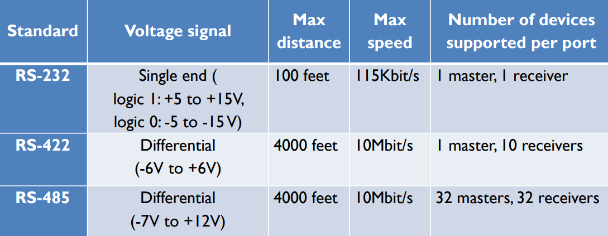
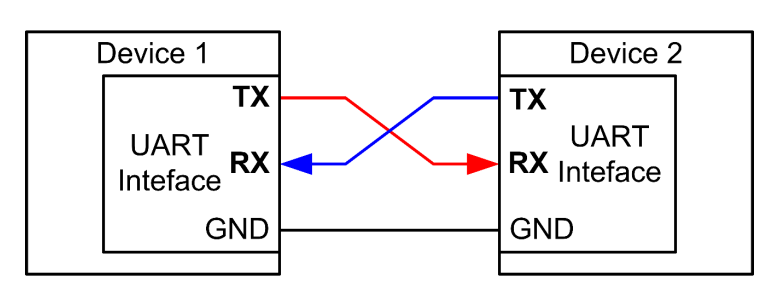
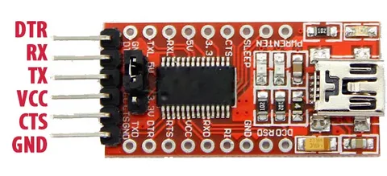
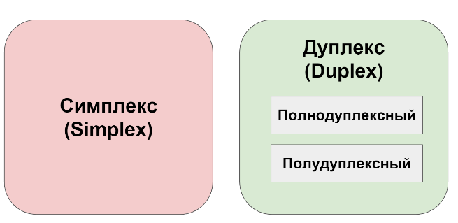
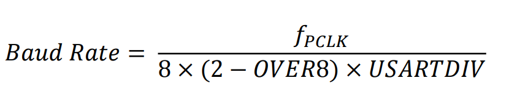
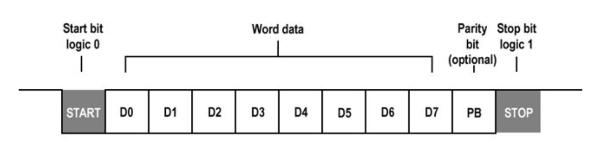
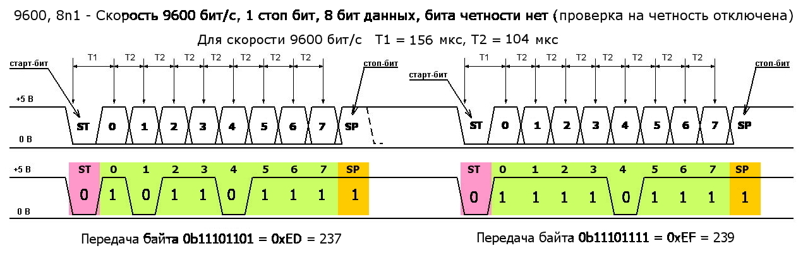
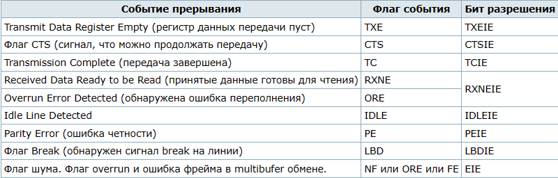
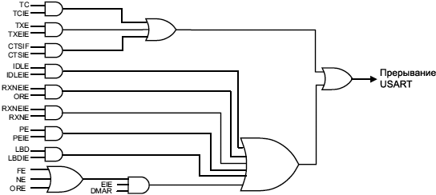
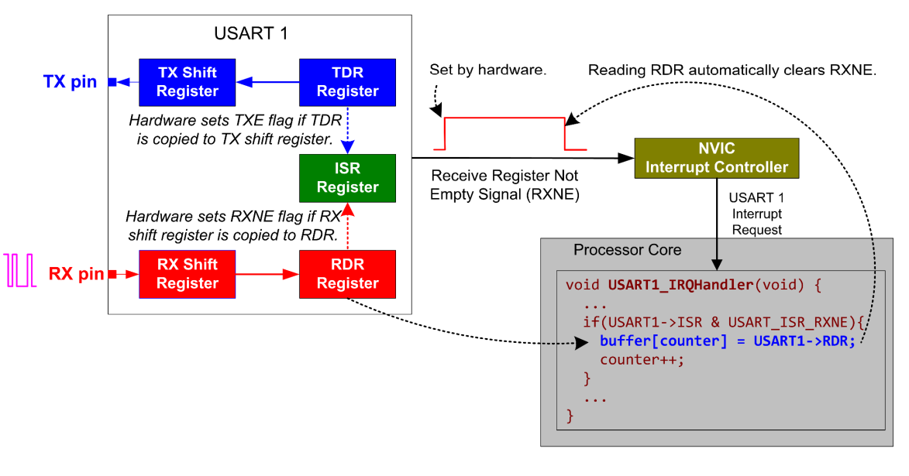

* NUCLEO-F401RE
* STM32F401RET6U
* ARM Cortex M4
* CMSIS
* STM32 CubeIDE v1.13.2
  
# USART (universal synchronous asynchronous receiver transmitter)

Микроконтроллер STM32F4 имеет несколько  универсальных СИНХРОННЫХ/АСИНХРОННЫХ модулей приемо-передатчика USART. То есть модуль может работать как в синхронном режиме (с синхронизацией), так
и в асинхронном (без синхронизации) Для работы в синхронном режиме, кроме вывода приема RX(**PA10**) и вывода передачи TX(**PA9**), необходим дополнительный вывод тактирования. В подавляющем большинстве случаев, нет необходимости усложнять аппаратную и программную части устройства, использованием модуля в синхронном режиме. Поэтому СИНХРОННЫЙ/АСИНХРОННЫЙ модуль приемо-передатчика USART чаще всего настраивают на работу в асинхронный режим. Модуль, который может работать только в асинхронном режиме, называется UART.

Прием и передача происходит по **стандартному асинхронному протоколу передачи данных**

> Впервые протокол был описан стандартом RS-232 (описание процесса передачи данных)
 <p align="center">

</<p align="center">


 <p align="center">

</<p align="center">


Интерфейс обычно подключается к внешним системам тремя ножками. Любой двунаправленный обмен UART требует как минимум двух сигнальных выводов: входные принимаемые данные (Receive Data In, RX) и выходные передаваемые данные (Transmit Data Out, TX)

Соответственно, двусторонняя связь между двумя устройствами будет только тогда, когда вывод передатчика первого устройства соединен с выводом приемника второго устройства, а вывод приемника первого устройства соединен с выводом передатчика второго устройства. **То есть соединение должно быть крест-накрест**.

FTD1213 преобразует порт UART в USB interface

<p align="center">

</<p align="center">

## Способы связи
<p align="center">

</<p align="center">


**ВСЕ НАСТРОЙКИ ПАРАМЕТРОВ СВЯЗИ НА УСТРОЙСТВАХ, МЕЖДУ КОТОРЫМИ ОСУЩЕСТВЛЯЕТСЯ ОБМЕН ДАННЫМИ (МК И КОМПЬЮТЕР ИЛИ МК И МК ИЛИ КОМПЬЮТЕР И КОМПЮТЕР И ДР.) ДОЛЖНЫ БЫТЬ
ОДИНАКОВЫМИ.**

<p align="center">

</<p align="center">


Значение OVER8 выбирается в зависимости от того, какая скорость передачи данных нужна. Если нужна высокая скорость, то OVER8 устанавливается в 1, если низкая - в 0.

USARTDIV это число с фиксированной запятой без знака, закодированное в регистре USART_BRR.

* Когда OVER8=0, дробная часть кодируется 4 битами, и программируется битами DIV_fraction[3:0] регистра USART_BRR.
* Когда OVER8=1, дробная часть кодируется 3 битами, и программируется битами DIV_fraction[2:0] регистра USART_BRR, и бит DIV_fraction[3] должен сохраняться сброшенным в 0.
  
## Бит четности
<p align="center">

</<p align="center">

## Передача данных


## Прерывания 
<p align="center">

</<p align="center">

### События прерываний USART подсоединены к одному и тому же вектору прерывания 


<p align="center">

</<p align="center">

### Прием данных

<p align="center">

</<p align="center">

## Сборка проекта
Собрать программу можно с помощью утилиты `make` для этого надо иметь `GNU Arm Embedded Toolchain` 

Если вы используете **STM32CubeIDE** с дефолтным расположением на диске C при установке, то вы можете прописать в системной переменной среды `Path` следующую команду 

`C:\ST\STM32CubeIDE_1.13.2\STM32CubeIDE\plugins\com.st.stm32cube.ide.mcu.externaltools.gnu-tools-for-stm32.11.3.rel1.win32_1.1.1.202309131626\tools\bin`

Также понадобится минимальный набор утилит для процессинга **Make** файлов , он также расположен в:

`C:\ST\STM32CubeIDE_1.13.2\STM32CubeIDE\plugins\com.st.stm32cube.ide.mcu.externaltools.make.win32_2.1.0.202305091550\tools\bin`

Открываем консоль `cmd` в папке склонированного репозитория и вводим следующие команды

```c
cd Debug
make all
```
На выходе вы получаете файл с расширением `.hex` в папке Debug

Для запуска программы понадобиться `STM32 ST-LINK Utility.exе` c помощью которой вы сможете зашить **.hex** файл в МК

Если вы используете **STM32 CubeIDE v1.13.2** то вы можете также добавить свой проект в свой WORKSPACE кликнув на файл `.project`

